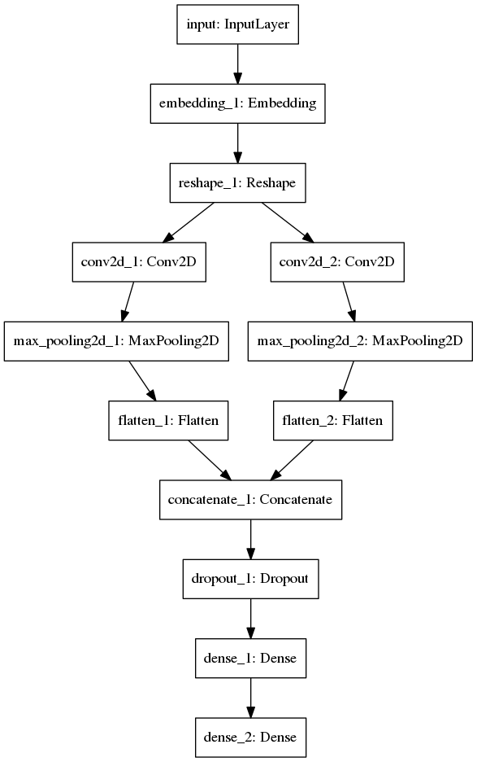

#HSLIDE
# Text Summarization using Deep Learning

#HSLIDE
## Prima Focus
* Major Focus for this project is on extractive text summarization.
* This involves extracting sentences as it is from the given text to form a summary.
* General approach followed(before Deep Learning became a craze) was to find the saliency of sentences using hand engineered features.
* In this project we aim to shift to a more data centric model where features as well are learned from data.

#HSLIDE
Approaches studied till now(cited later) use:
* Convolutional Neural Network(CNN)
* Recurrent Nerual Network
	* More specifically LSTMs(Long Short Term Memory) [LSTMs by Colah](http://colah.github.io/posts/2015-08-Understanding-LSTMs/)

We have decided to move forward with a CNN based approach for now.

#HSLIDE
As initial part of model building process Word Vectors and consequently Paragraph vectors were studied.
* Word Vectors convert each word into n-dimensional vector by training them on prediction task.
* These vectors capture certain properties specific to the task they were trained for.
	* For example semnatic meanings as shown in the original paper.
* They also exhibit certain simple vector operations to language very well.

Post studying about them a simple model using the proposed was built.

#VSLIDE
* Currently I am working on building a CNN-based model for Sentence catagorization into:
	* Sentence should belong to summary
	* Sentence should not belong to summary

```python
	class SentenceCNN(object):
    	#Define Init Function
    		def __init__(self,sequence_length,num_classes,vocab_size,embedding_size,
                	 filter_sizes,num_filters,hidden_states,l2_reg=0.0):
```
PS: Explain structure from above and [diagram](http://aclweb.org/anthology/D/D14/D14-1181.pdf) for further illustration.

* For providing ground truths for training we plan to use the para-phrase system for labelling the sentences as extractive summaries as gold-labels are not available.
* For doing so the above mentioned model was used for training the para-phrase detector and it was used to generate the labels for each sentence.
#HSLIDE


#HSLIDE
* In the implemented model the the above shown three convolutional layers compute the convolution using filters of sizes 2,3 and 4 respectively. 
* This means that the filters compute features considering 2,3 and 4 words of sentences at a time.
* The pooling layers perform a max-over-time pooling which basically select the maximum feature value from each vector as its output.
* Dropout layer is to ensure that the model does not memorize the dataset which it often can given such large number of parameters. 

#VSLIDE
* This leads a poorly generalised model and Dropout is one of many approaches used to address this issue.
###Issues:
* One issue that we face with this is the problem of over-fitting which might be because the model is much more complex than the
amount of corpus available. Currently, to deal with this situation the complexity of the model was reduced.
* In the mean time search for a bigger corpus especially in Indian languages,as well as annotation of prior exsisting is being carried out.

#HSLIDE
###Future possible work:
* One possible issue with above model could be that it is unable to capture document level features.
* For improving that we can convolve not just over sentences but over documents.
* Map Documents-> Video Clip ,just like Sentence-> Image.
#HSLIDE
## References

* [Convolutional Neural Networks for Sentence Classification](http://aclweb.org/anthology/D/D14/D14-1181.pdf) by Yoon Kim
* [Extraction of Salient Sentences from Labelled Documents](https://arxiv.org/pdf/1412.6815.pdf) by Misha Denil,Alban Demiraj,Nando de Freitas
* [Distributed Representations of Sentences and Documents](https://cs.stanford.edu/~quocle/paragraph_vector.pdf) by Quoc Le,Tomas Mikolov
